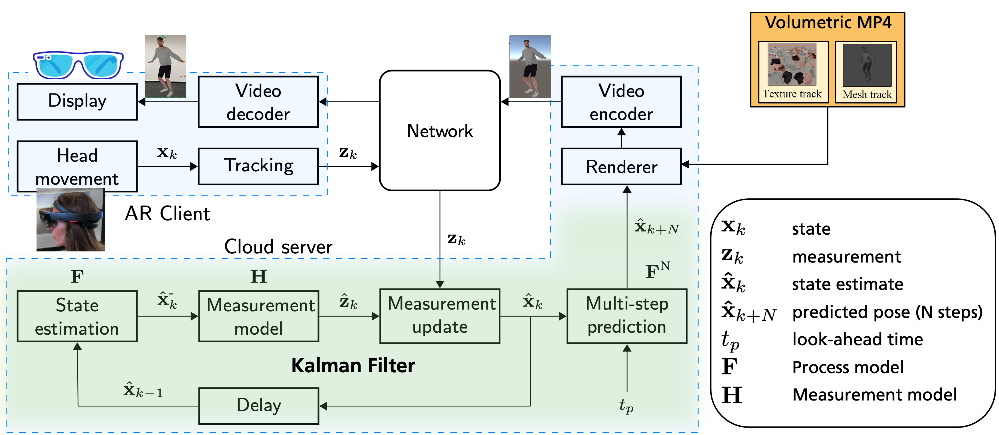

# 6DoF Head Motion Prediction using Kalman Filter

This project contains an implementation of our ACM Multimedia 2020 paper ["Kalman Filter-based Head Motion Prediction for Cloud-based Mixed Reality"](https://dl.acm.org/doi/10.1145/3394171.3413699).


## Motivation
Rendering volumetric videos requires a high amount of computation which is challenging for mobile devices. A promising technique to reduce the computational burden on mobile devices is to perform the rendering at a cloud server. However, cloud-based rendering systems suffer from an increased interaction (motion-to-photon) latency that may cause registration errors in Mixed Reality (MR) environments. One way of reducing the effective latency is to predict the viewer’s head pose and render the corresponding view from the volumetric video in advance.

In our work presented in [ACMMM'20](https://2020.acmmm.org) conference, we developed a Kalman filter-based predictor for head motion prediction in 6DoF space and evaluated its performance compared to an autoregression model and a baseline model (no prediction) using head motion traces recorded via Microsoft HoloLens. Please check the paper and the [video](https://youtu.be/nvZkJQDrOEo) of our presentation for more details.

In this repository, we present our dataset and Python simulation framework which reproduces the results in our paper.

## Repository Contents
**data**:
- **raw**: 14 traces collected using HoloLens. The format is: timestamp,x,y,z,qx,qy,qz,qw
- **interpolated**: Contains the interpolated traces resampled with a given sampling time (default: 5ms or 200Hz).

**pred6dof**:
Module that contains the prediction end evaluation scripts.
- **application&#46;py**: Entry point. Provides a command line interface for the pred6dof application.
- **runners&#46;py**: Implements predictors and runs them on the given user traces. Results are saved to CSV files in folder *results/tabular*.
- **evaluator&#46;py**: Computes the metrics mean absolute error (MAE) and root mean-squared error (RMSE) for a given trace and look-ahead time.
- **reporter&#46;py**: Computes and plots average results over all traces for different predictors, plots per-trace results and trace statistics. Additionally, a PDF file is generated with the reproduced plots and saved to *acmmm20.pdf* at the top-level directory (assuming you have a Latex distribution installed on your machine)

**results**:
- **figures**: contains the plots for average performance of predictors over all traces, trace statistics, box plots for individual traces.
- **tabular**: CSV files containing the prediction results for each trace and average results.

**autoreg_models**: Models for the benchmark AutoReg predictor, trained separately for different positional (x,y,z) and quaternion coordinates (qw,qx,qy,qz).

**acmmm20_src**: Latex source files; used to automatically generate the paper as PDF using the reproduced figures.

**config.toml**:  Configuration parameters.

**environments.yml**: Package specification for conda.

**requirements.txt**: Package specification for pip.

## Installation and Running
You can use either conda or pip to instal the dependencies. Conda provides an isolated environment and allows installing all dependencies automatically without interfering with your system. With pip, you can create virtualenv and install the dependencies there to achieve the same.
### Using conda
1. You need to have [conda](https://docs.conda.io/en/latest/) installed on your system. Installers for different OS can be found [here](https://docs.conda.io/en/latest/miniconda.html).
2. Generate a conda environment containing the required packages and enable it:

  ```shell
  conda env create -f environment.yml
  conda activate pred6dof
  ``` 

3. Run `compute-all.sh`. This runs the Kalman filter, AutoReg and baseline (no-prediction) on all user traces and  reproduces the plots presented in the paper in *results/figures*. Specifically, it performs the following operations:
  - Resamples the collected raw traces evenly with a sampling time of 5ms and saves them to ./data/interpolated. 
    ```shell
    python -m pred6dof prepare
    ```
  - Runs the tested predictors (Kalman, AutoReg, baseline/no-prediction) for the look-ahead times [20,40,60,80,100] ms.
    ```shell
    python -m pred6dof run -a kalman -w 20 40 60 80 100
    python -m pred6dof run -a autoreg -w 20 40 60 80 100
    python -m pred6dof run -a baseline -w 20 40 60 80 100
    ```
  - Computes mean results over all traces and generates the figures presented in the paper. Additionally, a PDF file is generated with the reproduced plots and saved to *acmmm20.pdf* at the top-level directory.
    ```shell
    python -m pred6dof report
    ```
### Using pip
  1. Create a virtualenv and activate it:
   ```shell
   python3 -m venv pred6dof
  source pred6dof/bin/activate
   ```
  2. Install the dependencies:
  ```shell
  pip install -r requirements.txt
  ```
  3. Run `compute-all.sh` (see description above).


### Remarks
- You can check all options with `python -m pred6dof run -h`. For example. you can run the Kalman predictor for a look-ahead time of 20 ms like this: `python -m pred6dof run -a kalman -w 20`.
- Grab a coffee after you run `compute-all.sh`. It takes a while to iterate over all traces for all look-ahead times, especially for AutoReg predictor - around 35 minutes on my machine (MacBook Pro 2019, 2,4 GHz 8-Core Intel Core i9). 
- Tested on macOS 10.15 and Ubuntu 20.04.


## Citation
If you make use of this code in your own work, please cite the following work:

Serhan Gül, Sebastian Bosse, Dimitri Podborski, Thomas Schierl, and Cornelius Hellge. 2020. Kalman Filter-based Head Motion Prediction for Cloud-based Mixed Reality. In <i>Proceedings of the 28th ACM International Conference on Multimedia</i> (<i>MM '20</i>). Association for Computing Machinery, New York, NY, USA, 3632–3641. DOI: https://doi.org/10.1145/3394171.3413699

```bibtex
@inproceedings{GuelACMMM20,
author = {G\"{u}l, Serhan and Bosse, Sebastian and Podborski, Dimitri and Schierl, Thomas and Hellge, Cornelius},
title = {Kalman Filter-Based Head Motion Prediction for Cloud-Based Mixed Reality},
year = {2020},
publisher = {Association for Computing Machinery},
address = {New York, NY, USA},
url = {https://doi.org/10.1145/3394171.3413699},
doi = {10.1145/3394171.3413699},
booktitle = {Proceedings of the 28th ACM International Conference on Multimedia},
pages = {3632–3641},
location = {Seattle, WA, USA},
series = {MM '20}
}
```

## License

The copyright in this software is being made available under this Software Copyright License. This software may be subject to other third party and contributor rights, including patent rights, and no such rights are granted under this license. Copyright (c) 1995 - 2021 Fraunhofer-Gesellschaft zur Förderung der angewandten Forschung e.V. (Fraunhofer) All rights reserved. Redistribution and use in source and binary forms, with or without modification, are permitted for purpose of testing the functionalities of this software provided that the following conditions are met:

* Redistributions of source code must retain the above copyright notice, this list of conditions and the following disclaimer.

* Redistributions in binary form must reproduce the above copyright notice, this list of conditions and the following disclaimer in the documentation and/or other materials provided with the distribution.

* Neither the names of the copyright holders nor the names of its contributors may be used to endorse or promote products derived from this software without specific prior written permission.

THIS SOFTWARE IS PROVIDED BY THE COPYRIGHT HOLDERS AND CONTRIBUTORS "AS IS" AND ANY EXPRESS OR IMPLIED WARRANTIES, INCLUDING, BUT NOT LIMITED TO, THE IMPLIED WARRANTIES OF MERCHANTABILITY AND FITNESS FOR A PARTICULAR PURPOSE ARE DISCLAIMED. IN NO EVENT SHALL THE COPYRIGHT HOLDERS OR CONTRIBUTORS BE LIABLE FOR ANY DIRECT, INDIRECT, INCIDENTAL, SPECIAL, EXEMPLARY, OR CONSEQUENTIAL DAMAGES (INCLUDING, BUT NOT LIMITED TO, PROCUREMENT OF SUBSTITUTE GOODS OR SERVICES; LOSS OF USE, DATA, OR PROFITS; OR BUSINESS INTERRUPTION) HOWEVER CAUSED AND ON ANY THEORY OF LIABILITY, WHETHER IN CONTRACT, STRICT LIABILITY, OR TORT (INCLUDING NEGLIGENCE OR OTHERWISE) ARISING IN ANY WAY OUT OF THE USE OF THIS SOFTWARE, EVEN IF ADVISED OF THE POSSIBILITY OF SUCH DAMAGE. NO EXPRESS OR IMPLIED LICENSES TO ANY PATENT CLAIMS, INCLUDING WITHOUT LIMITATION THE PATENTS OF THE COPYRIGHT HOLDERS AND CONTRIBUTORS, ARE GRANTED BY THIS SOFTWARE LICENSE. THE COPYRIGHT HOLDERS AND CONTRIBUTORS PROVIDE NO WARRANTY OF PATENT NON-INFRINGEMENT WITH RESPECT TO THIS SOFTWARE.

